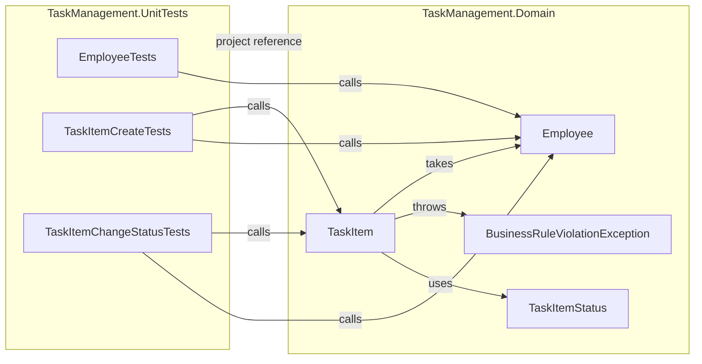

# Code map

Generated from the CodeGraph index (`codegraph sync .`, CodeGraph 1.6.0) after fan-in A. Regenerated after every fan-in. Source of truth for contracts: [[spec]].

## Index

Files: 8 | Nodes: 92 | Edges: 208 | Nodes by Kind: 45 methods, 14 properties, 7 files, 7 namespaces, 6 classes, 5 constants, 4 enum_members, 3 imports, 1 enum

## Projects

| Project | Path | Project references | Package references |
|---|---|---|---|
| TaskManagement.Domain | src/TaskManagement.Domain/TaskManagement.Domain.csproj | none | none |
| TaskManagement.Infrastructure | src/TaskManagement.Infrastructure/TaskManagement.Infrastructure.csproj | TaskManagement.Domain | Microsoft.EntityFrameworkCore 10.0.12, Microsoft.EntityFrameworkCore.Relational 10.0.12, Microsoft.EntityFrameworkCore.Design 10.0.12, Npgsql.EntityFrameworkCore.PostgreSQL 10.0.3 |
| TaskManagement.Application | src/TaskManagement.Application/TaskManagement.Application.csproj | TaskManagement.Domain, TaskManagement.Infrastructure | none |
| TaskManagement.UnitTests | tests/TaskManagement.UnitTests/TaskManagement.UnitTests.csproj | TaskManagement.Domain | Microsoft.NET.Test.Sdk 17.14.1, xunit 2.9.3, xunit.runner.visualstudio 3.1.4 |
| TaskManagement.IntegrationTests | tests/TaskManagement.IntegrationTests/TaskManagement.IntegrationTests.csproj | TaskManagement.Domain, TaskManagement.Infrastructure, TaskManagement.Application | Microsoft.NET.Test.Sdk 17.14.1, Testcontainers.PostgreSql 4.15.0, xunit 2.9.3, xunit.runner.visualstudio 3.1.4 |

## Namespaces and types

### TaskManagement.Domain

| Type | Kind | File | Members |
|---|---|---|---|
| Employee | class | src/TaskManagement.Domain/Employee.cs | FullNameMaxLength, EmailMaxLength, Id, FullName, Email, IsActive, Create, Deactivate |
| TaskItem | class | src/TaskManagement.Domain/TaskItem.cs | TitleMaxLength, Id, Title, Status, CreatorId, AssigneeId, PlannedStartAt, DueAt, CompletedAt, Version, Create, ChangeStatus |
| TaskItemStatus | enum | src/TaskManagement.Domain/TaskItemStatus.cs | New, InProgress, Completed, Cancelled |
| BusinessRuleViolationException | class | src/TaskManagement.Domain/BusinessRuleViolationException.cs | RuleId |

### TaskManagement.UnitTests

| Test class | File | Test methods (`[Fact]` + `[Theory]`) |
|---|---|---|
| EmployeeTests | tests/TaskManagement.UnitTests/EmployeeTests.cs | 13: Create_ValidInput_SetsPropertiesAndIsActive, Create_MixedCaseEmailWithSpaces_StoresTrimmedLowercase, Create_NullFullName_ThrowsArgumentNullException, Create_BlankFullName_ThrowsArgumentException, Create_FullNameOf200Chars_Succeeds, Create_FullNameOf201Chars_ThrowsArgumentException, Create_NullEmail_ThrowsArgumentNullException, Create_BlankEmail_ThrowsArgumentException, Create_EmailOf254Chars_Succeeds, Create_EmailOf255Chars_ThrowsArgumentException, Create_TwoCalls_ReturnDistinctIds, Deactivate_ActiveEmployee_SetsIsActiveFalse, Deactivate_InactiveEmployee_StaysInactive |
| TaskItemCreateTests | tests/TaskManagement.UnitTests/TaskItemCreateTests.cs | 16: Create_ValidInput_StartsAsNewWithNullCompletedAt, Create_ValidInput_CopiesTitleIdsAndDates, Create_TitleWithSurroundingSpaces_StoresTrimmedTitle, Create_NullTitle_ThrowsArgumentNullException, Create_BlankTitle_ThrowsArgumentException, Create_TitleOf201Chars_ThrowsArgumentException, Create_NullCreator_ThrowsArgumentNullException, Create_NullAssignee_ThrowsArgumentNullException, Create_AssigneeIsCreator_ThrowsBusinessRuleViolationBR5, Create_InactiveAssignee_ThrowsBusinessRuleViolationBR3, Create_InactiveCreatorActiveAssignee_Succeeds, Create_DueAtBeforePlannedStartAt_ThrowsBusinessRuleViolationBR2, Create_DueAtEqualsPlannedStartAt_Succeeds, Create_PlannedStartAtOrDueAtMissing_Succeeds, Create_NonUtcOffsets_StoresSameInstantWithZeroOffset, Create_DueAtBeforePlannedStartAtAfterUtcConversion_ThrowsBusinessRuleViolationBR2 |
| TaskItemChangeStatusTests | tests/TaskManagement.UnitTests/TaskItemChangeStatusTests.cs | 5: ChangeStatus_TransitionTableRow_BehavesAsSpecified, ChangeStatus_ToCompleted_SetsCompletedAtToChangedAt, ChangeStatus_ToCompletedWithNonUtcOffset_StoresUtcInstant, ChangeStatus_FromCompleted_KeepsStatusAndCompletedAt, ChangeStatus_UndefinedStatus_ThrowsArgumentOutOfRangeException |

### TaskManagement.Infrastructure, TaskManagement.Application, TaskManagement.IntegrationTests

No code yet (wave B).

## Dependencies

| From (test class) | Calls (domain member) |
|---|---|
| EmployeeTests | Employee.Create |
| EmployeeTests | Employee.Deactivate |
| TaskItemCreateTests | Employee.Create |
| TaskItemCreateTests | TaskItem.Create |
| TaskItemChangeStatusTests | Employee.Create |
| TaskItemChangeStatusTests | TaskItem.ChangeStatus |

## Diagram

