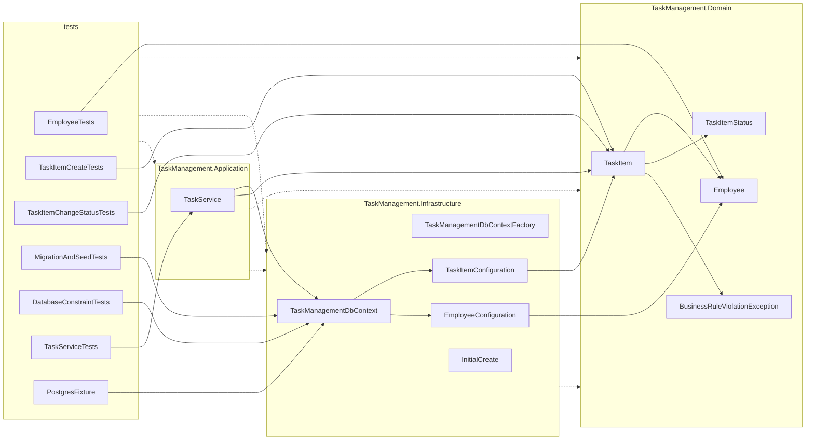

# Code map

Generated from the CodeGraph index (`codegraph sync .`, CodeGraph 1.6.0) after fan-in B; test counts updated after D4 (review fixes). Regenerated after every fan-in. Source of truth for contracts: [[spec]].

## Index

21 files, 289 nodes, 593 edges (after D4; per-kind counts as of fan-in B: method:106, import:56, class:20, file:20, namespace:19, property:16, constant:13, field:12, function:10, enum_member:4, variable:3, enum:1). Includes `.claude/hooks/wiki_checkpoint.py` (tooling).

## Projects

| Project | Path | Project references | Package references |
|---|---|---|---|
| TaskManagement.Domain | src/TaskManagement.Domain | none | none |
| TaskManagement.Infrastructure | src/TaskManagement.Infrastructure | TaskManagement.Domain | Microsoft.EntityFrameworkCore 10.0.12, Microsoft.EntityFrameworkCore.Relational 10.0.12, Microsoft.EntityFrameworkCore.Design 10.0.12, Npgsql.EntityFrameworkCore.PostgreSQL 10.0.3 |
| TaskManagement.Application | src/TaskManagement.Application | TaskManagement.Domain, TaskManagement.Infrastructure | none |
| TaskManagement.UnitTests | tests/TaskManagement.UnitTests | TaskManagement.Domain | Microsoft.NET.Test.Sdk 17.14.1, xunit 2.9.3, xunit.runner.visualstudio 3.1.4 |
| TaskManagement.IntegrationTests | tests/TaskManagement.IntegrationTests | TaskManagement.Domain, TaskManagement.Infrastructure, TaskManagement.Application | Microsoft.NET.Test.Sdk 17.14.1, Testcontainers.PostgreSql 4.15.0, xunit 2.9.3, xunit.runner.visualstudio 3.1.4 |

## Namespaces and types

### TaskManagement.Domain
| Type | Kind | File | Members |
|---|---|---|---|
| Employee | class | src/TaskManagement.Domain/Employee.cs | FullNameMaxLength, EmailMaxLength, Id, FullName, Email, IsActive, Create, Deactivate |
| TaskItem | class | src/TaskManagement.Domain/TaskItem.cs | TitleMaxLength, Id, Title, Status, CreatorId, AssigneeId, PlannedStartAt, DueAt, CompletedAt, Version, Create, ChangeStatus |
| TaskItemStatus | enum | src/TaskManagement.Domain/TaskItemStatus.cs | New, InProgress, Completed, Cancelled |
| BusinessRuleViolationException | class | src/TaskManagement.Domain/BusinessRuleViolationException.cs | RuleId |

### TaskManagement.Infrastructure (+ .Configurations, .Migrations)
| Type | Kind | File | Members / purpose |
|---|---|---|---|
| TaskManagementDbContext | class | src/TaskManagement.Infrastructure/TaskManagementDbContext.cs | Employees, Tasks, OnModelCreating |
| TaskManagementDbContextFactory | class | src/TaskManagement.Infrastructure/TaskManagementDbContextFactory.cs | CreateDbContext |
| EmployeeConfiguration | class | src/TaskManagement.Infrastructure/Configurations/EmployeeConfiguration.cs | Configure |
| TaskItemConfiguration | class | src/TaskManagement.Infrastructure/Configurations/TaskItemConfiguration.cs | Configure |
| InitialCreate | EF Core migration | src/TaskManagement.Infrastructure/Migrations/ | 20260918164447_InitialCreate.cs, 20260918164447_InitialCreate.Designer.cs, TaskManagementDbContextModelSnapshot.cs |

### TaskManagement.Application
| Type | Kind | File | Members |
|---|---|---|---|
| TaskService | class | src/TaskManagement.Application/TaskService.cs | dbContext, timeProvider, CreateTaskAsync, ChangeTaskStatusAsync, ListTasksByAssigneeAsync |

### Tests
| Test class | Project | File | Test methods |
|---|---|---|---|
| EmployeeTests | TaskManagement.UnitTests | tests/TaskManagement.UnitTests/EmployeeTests.cs | 13 |
| TaskItemCreateTests | TaskManagement.UnitTests | tests/TaskManagement.UnitTests/TaskItemCreateTests.cs | 18 |
| TaskItemChangeStatusTests | TaskManagement.UnitTests | tests/TaskManagement.UnitTests/TaskItemChangeStatusTests.cs | 5 |
| MigrationAndSeedTests | TaskManagement.IntegrationTests | tests/TaskManagement.IntegrationTests/MigrationAndSeedTests.cs | 4 |
| DatabaseConstraintTests | TaskManagement.IntegrationTests | tests/TaskManagement.IntegrationTests/DatabaseConstraintTests.cs | 14 |
| TaskServiceTests | TaskManagement.IntegrationTests | tests/TaskManagement.IntegrationTests/TaskServiceTests.cs | 19 |
| PostgresFixture | TaskManagement.IntegrationTests | tests/TaskManagement.IntegrationTests/PostgresFixture.cs | fixture |

## Dependencies

| From | To | Via |
|---|---|---|
| TaskServiceTests | TaskService | CreateTaskAsync |
| TaskServiceTests | TaskService | ChangeTaskStatusAsync |
| TaskServiceTests | TaskService | ListTasksByAssigneeAsync |
| TaskItemChangeStatusTests | TaskItem | ChangeStatus |
| TaskService | TaskManagementDbContext | constructor injection |
| TaskItem | Employee | `Create(creator, assignee)` parameters (no navigations) |
| TaskItem | TaskItemStatus | Status property |
| TaskItem | BusinessRuleViolationException | thrown by Create (BR2, BR3, BR5) and ChangeStatus (BR4) |
| TaskItemConfiguration | TaskItem | Configure |
| EmployeeConfiguration | Employee | Configure |
| TaskManagementDbContext | TaskItemConfiguration | OnModelCreating |
| TaskManagementDbContext | EmployeeConfiguration | OnModelCreating |
| DatabaseConstraintTests | TaskManagementDbContext | raw SQL via `Database.ExecuteSqlRawAsync`; EF for the concurrency test |
| MigrationAndSeedTests | TaskManagementDbContext | migrations API and seed queries |
| PostgresFixture | TaskManagementDbContext | creates a migrated database and context per test |
| EmployeeTests | Employee | Create, Deactivate |
| TaskItemCreateTests | TaskItem, Employee | TaskItem.Create, Employee.Create |
| TaskService | TaskItem | Create, ChangeStatus |

## Diagram

