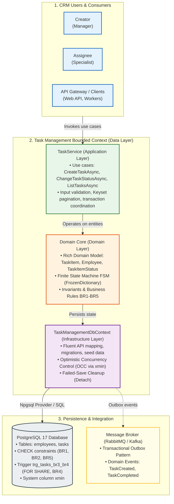
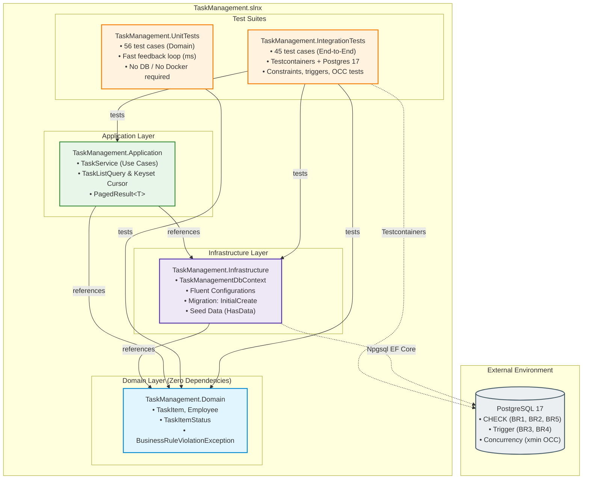
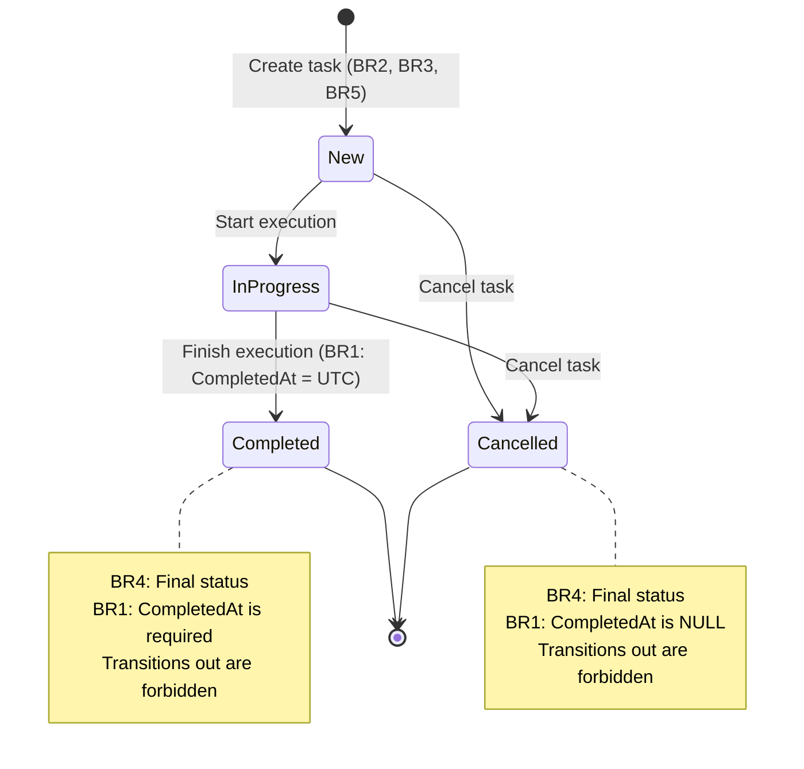

# Task Management: data layer

[ Decision Process (README) ](README.md) · [ Технічний опис (Українська) ](README.uk.md) · [ **Technical Overview (English)** ]

Task Management is the internal CRM module for assigning, executing and controlling employees' tasks. This repository is its data layer on PostgreSQL + EF Core: domain entities, persistence, an application service, and tests. Scope is backend/data only: no web API, no UI, no server host.

| Job | Use case | Implementation |
|---|---|---|
| Assigning: a creator gives a task to an employee | `CreateTaskAsync` | domain creation guards, application service; enforces BR2, BR3, BR5 |
| Executing: the task moves through its statuses | `ChangeTaskStatusAsync` | domain status transition logic; enforces BR1, BR4 |
| Controlling: what does an employee have, in which status, due when | `ListTasksAsync` (`TaskListQuery`: keyset pagination with `TaskCursor`/`PagedResult`, status, creator, due date filters; compatible `ListTasksByAssigneeAsync`), ordered by deadline | application service query; uses `ix_tasks_assignee_id_status` index |

## High-level system context



## Solution layout



| Project (path) | Holds |
|---|---|
| `src/TaskManagement.Domain` | entities (`Employee`, `TaskItem`), enum (`TaskItemStatus`), domain exception (`BusinessRuleViolationException`) |
| `src/TaskManagement.Infrastructure` | `TaskManagementDbContext`, Fluent configurations, seed data (via `HasData`), migration `InitialCreate`, design-time factory |
| `src/TaskManagement.Application` | `TaskService` with the three use cases: `CreateTaskAsync`, `ChangeTaskStatusAsync`, `ListTasksAsync` / `ListTasksByAssigneeAsync`, `TaskListQuery`, `TaskCursor`, `PagedResult<T>` |
| `tests/TaskManagement.UnitTests` | domain unit tests (36 test methods, 56 test cases after theory expansion); references Domain only |
| `tests/TaskManagement.IntegrationTests` | PostgreSQL database tests and service integration tests (44 test methods, 45 test cases); references Domain, Infrastructure, Application; runs against Testcontainers |

## Quickstart

Requires **.NET 10 SDK** and **Docker** (for Testcontainers with PostgreSQL 17). For detailed platform selection rationale and stack analysis, see [README.md (Section 2.1)](README.md#21-стратегічний-вибір-платформи-net-10-lts-vs-sts-та-субд-postgresql-17).

### Build & Tests

Build with warnings treated as errors (`TreatWarningsAsErrors`):
```bash
dotnet build -warnaserror
```

Run unit tests only (fast feedback loop, no Docker required):
```bash
dotnet test --filter Category=Unit
```

Run all 101 tests (including 45 integration tests on PostgreSQL 17 in Docker):
```bash
dotnet test
```

> **Note on CI/CD:** An external CI pipeline was consciously omitted (YAGNI). All 101 tests and quality gates (`TreatWarningsAsErrors`) are deterministically verified locally via Testcontainers and real PostgreSQL 17 (for rationale, see [README.md (Section 4.5)](README.md#45-свідома-відмова-від-побудови-ci-пайплайну-conscious-choice--yagni)).

### Migrations (EF Core CLI)

Add a new migration:
```bash
dotnet ef migrations add <Name> --project src/TaskManagement.Infrastructure
```

Apply migrations to target database:
```bash
dotnet ef database update --project src/TaskManagement.Infrastructure --connection "<connection string>"
```

> Initial migration `InitialCreate` automatically creates the full schema (tables, indexes, CHECK constraints, trigger `trg_tasks_br3_br4`) and minimal seed data for verification.

## Where each business rule is enforced



| Rule | Statement | Domain | Database | Application service |
|---|---|---|---|---|
| BR1 | `CompletedAt` is required when, and only when, status = `Completed` | `TaskItem.Create` sets `CompletedAt = null`; `TaskItem.ChangeStatus` sets it to `changedAt` (UTC) iff new status is `Completed`, else `null` | `ck_tasks_br1_completed_at_iff_completed` | `TaskService.ChangeTaskStatusAsync` passes `timeProvider.GetUtcNow()` as `changedAt` |
| BR2 | `DueAt` cannot be earlier than `PlannedStartAt` (nullable; rule applies only when both are set) | `TaskItem.Create` guard: after UTC normalisation, `dueAt < plannedStartAt` → exception | `ck_tasks_br2_due_at_not_before_planned_start_at` | `TaskService.CreateTaskAsync` via domain |
| BR3 | An inactive employee cannot be given a new task | `TaskItem.Create` guard: `!assignee.IsActive` → exception | `trg_tasks_br3_br4` trigger on INSERT: reads assignee `is_active` under `FOR SHARE`; inactive → `trg_tasks_br3_assignee_active` error | `TaskService.CreateTaskAsync` service check before domain; rethrows trigger error as `BusinessRuleViolationException("BR3", …, inner)` |
| BR4 | `Completed` and `Cancelled` are final (no transition out, including to self) | `TaskItem.ChangeStatus` guard: if current status is `Completed` or `Cancelled` → exception; nothing changes | `trg_tasks_br3_br4` trigger on `UPDATE OF status`: final status change attempt → `trg_tasks_br4_final_status` error; `xmin` concurrency token prevents concurrent writes | `TaskService.ChangeTaskStatusAsync` via domain; `DbUpdateConcurrencyException` propagates |
| BR5 | A task cannot be assigned to its creator (`assignee_id ≠ creator_id`) | `TaskItem.Create` guard: `creator.Id == assignee.Id` → exception | `ck_tasks_br5_assignee_not_creator` | `TaskService.CreateTaskAsync` via domain |

> **Verification & Seed Data:**
> - Full protocol of red-evidence verification (failing-then-passing test matrix upon disabling protections) and test suite results (101 tests) are documented in [docs/testing/red-evidence.en.md](docs/testing/red-evidence.en.md) (also see [README.md (Section 4.3)](README.md#43-результати-тестування-56-unit-тестів--45-інтеграційних-тестів-101-тест)).
> - Initial seed data (Olena Kovalenko, Bohdan Shevchenko, inactive Oksana Melnyk for BR3 testing, and 3 demo tasks) is detailed in [README.md (Section 1.3)](README.md#13-моделювання-демо-даних-seed-data-та-роль-неактивного-співробітника).
> - Engineering culture: isolated `git worktree` instances were used for parallel agent collaboration with subsequent cleanup via `git worktree prune` (see [README.md (Section 4.1)](README.md#інженерна-культура-та-git-worktrees-паралелізм-без-конфліктів)).
> - Anti-hallucination, critic skills (grill-me) & evidence-based verification: terminal output verification, `[uncertain]` protocol, `/grill-me` adversarial review, CodeGraph grounding, Red Evidence mutation testing, and production performance metrics (see [README.md (Sections 2.5, 4.6, 4.7)](README.md#46-інженерна-дисципліна-уникнення-галюцинацій-моделей-та-доказова-верифікація-anti-hallucination-framework)).

## Documentation

- **[README.md](README.md)**: Ukrainian version of this file (Україномовна версія цього файлу).
- **[AGENTS.md](AGENTS.md)**: Instructions for coding agents (Claude Code, Cursor, Codex, Antigravity, AWS Bedrock). Read first every session.
- **[.wiki/index.md](.wiki/index.md)**: Start here. Maps the domain spec, business rule pages, ADRs, the execution graph ([`.wiki/plan/graph.yaml`](.wiki/plan/graph.yaml)), the session log ([`.wiki/log.md`](.wiki/log.md)), the code map (built with CodeGraph) and the automatic progress checkpoints ([`.wiki/checkpoints/`](.wiki/checkpoints/)). English version: [`.wiki/index.en.md`](.wiki/index.en.md).
- **[.wiki/domain/spec.md](.wiki/domain/spec.md)**: Complete data model specification (N1 spec), with entities, constraints, indexes, trigger SQL, test plan, and verification (English version: [`.wiki/domain/spec.en.md`](.wiki/domain/spec.en.md)).
- **[.wiki/domain/](.wiki/domain/)**: Business rule pages ([`br1-completed-at.md`](.wiki/domain/br1-completed-at.md), [`br2-due-not-before-start.md`](.wiki/domain/br2-due-not-before-start.md), [`br3-inactive-assignee.md`](.wiki/domain/br3-inactive-assignee.md), [`br4-final-statuses.md`](.wiki/domain/br4-final-statuses.md), [`br5-no-self-assignment.md`](.wiki/domain/br5-no-self-assignment.md)) and entity pages ([`employee.md`](.wiki/domain/employee.md), [`task-item.md`](.wiki/domain/task-item.md)).
- **[docs/adr/](docs/adr/)**: Nine Architecture Decision Records ([0001](docs/adr/0001-solution-layout.md)-[0009](docs/adr/0009-br3-br4-enforced-by-trigger.md)). ADR 0009 supersedes ADR 0004. 0001 solution layout, 0002 assignee column, 0003 UUIDv7 keys, 0004 no DB constraint for BR3/BR4 (superseded), 0005 e-mail uniqueness, 0006 UTC and explicit time, 0007 status as text and the transition rule, 0008 the business-rule exception, 0009 the BR3/BR4 trigger.
