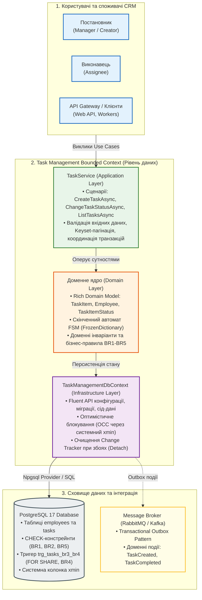
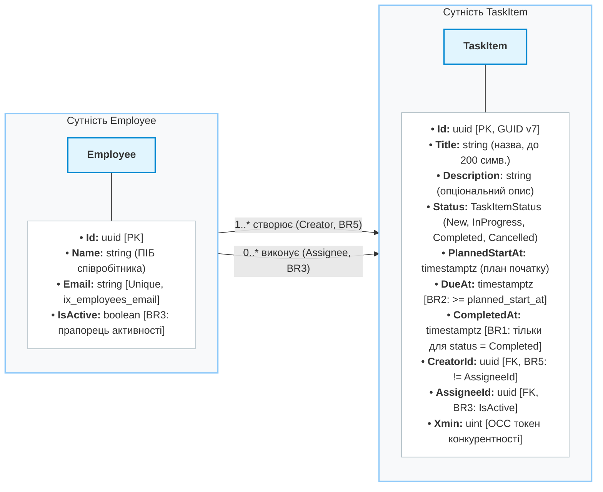
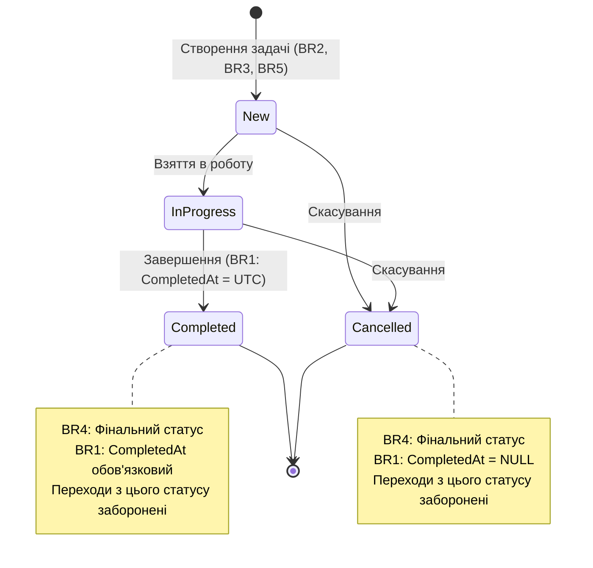
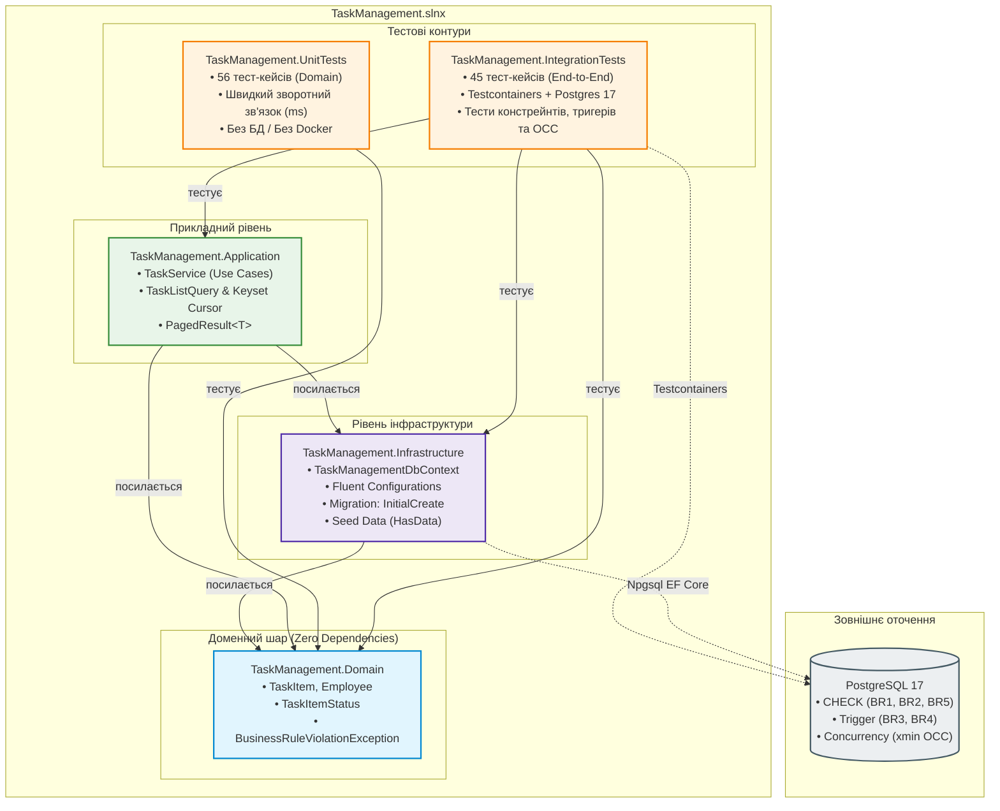
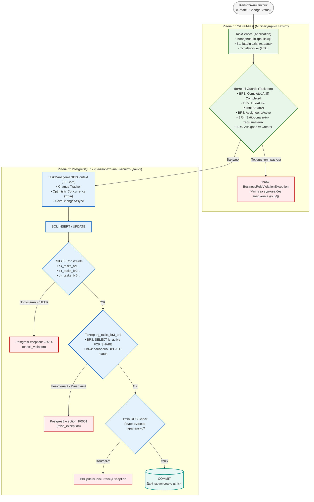

# Процес прийняття інженерних рішень: Task Management Data Layer
**Версія документа:** 1.0  
**Автор:** Senior Software Engineer  

## TL;DR (Коротко про головне)

- **Що зроблено:** Повноцінний, production-ready рівень даних (data layer) для CRM-модуля керування завданнями на стеку **.NET 10 (LTS) + C# 13/14 + PostgreSQL 17 + EF Core 10**.
- **Архітектура:** Чиста 5-проєктна структура (`Domain`, `Infrastructure`, `Application`, `UnitTests`, `IntegrationTests`) з Rich Domain Model (приватні сетери, валідація інваріантів у фабричних методах, нуль анемічності).
- **Цілісність даних (Defense in Depth):** Усі бізнес-правила (BR1-BR5) перевіряються двічі - у C# коді та ядром PostgreSQL через CHECK-констрейнти, тригери та оптимістичне блокування (OCC через системний токен `xmin`).
- **Високі навантаження:** Послідовні ідентифікатори **GUID v7** (здоров'я B-Tree індексів без розбиття сторінок), скінченний автомат (FSM) на базі `FrozenDictionary` за BDD, курсорна **Keyset-пагінація** (`TaskCursor`) замість повільного `OFFSET/LIMIT`.
- **Якість та верифікація:** **101/101 тестів пройдено** (56 unit + 45 інтеграційних на реальному PostgreSQL 17 via Testcontainers; жодного оманливого In-Memory). Режим `TreatWarningsAsErrors` - 0 помилок, 0 попереджень.
- **AI-процес:** Дисциплінована розробка через формальний DAG-граф із трьохрівневою ієрархією (Lead - Orchestrator - Workers), керованою токеномікою та адаптивними хуками збереження контексту (Context Engineering).

> **Супровідна технічна документація проєкту:**  
> - [Технічний опис та інструкція із запуску (Українська)](README.uk.md)  
> - [Technical Overview & Getting Started (English)](README.en.md)  
> - [AGENTS.md - Інструкції для агентів та стек](AGENTS.md)  
> - [.wiki/index.md - База знань проєкту](.wiki/index.md)  

---

## Зміст (Table of Contents)

1. [Погляд Аналітика: деконструкція бізнес-вимог та межі скоупу](#1-погляд-аналітика-деконструкція-бізнес-вимог-та-межі-скоупу)
   - [1.1. Аналіз вхідних вимог та визначення меж контексту (Bounded Context)](#11-аналіз-вхідних-вимог-та-визначення-меж-контексту-bounded-context)
   - [1.2. Деконструкція бізнес-правил (BR1-BR5)](#12-деконструкція-бізнес-правил-br1-br5)
   - [1.3. Моделювання демо-даних (Seed Data) та роль неактивного співробітника](#13-моделювання-демо-даних-seed-data-та-роль-неактивного-співробітника)
2. [Погляд Архітектора: стратегія платформи, системний дизайн та компроміси](#2-погляд-архітектора-стратегія-платформи-системний-дизайн-та-компроміси)
   - [2.1. Стратегічний вибір платформи (.NET 10 LTS vs STS) та СУБД (PostgreSQL 17)](#21-стратегічний-вибір-платформи-net-10-lts-vs-sts-та-субд-postgresql-17)
   - [2.2. Архітектурне розділення та свідомий компроміс із YAGNI](#22-архітектурне-розділення-та-свідомий-компроміс-із-yagni)
   - [2.3. Концепція «Глибинного захисту» (Defense in Depth)](#23-концепція-глибинного-захисту-defense-in-depth)
   - [2.4. Стратегія конкурентності та блокувань (OCC через xmin)](#24-стратегія-конкурентності-та-блокувань-occ-через-xmin)
   - [2.5. Мультиагентна та мультисистемна інфраструктура розробки (AI Architecture)](#25-мультиагентна-та-мультисистемна-інфраструктура-розробки-ai-architecture)
   - [2.6. Життєвий цикл даних: Hot/Cold Data, архівування та часткові індекси](#26-життєвий-цикл-даних-hotcold-data-архівування-та-часткові-індекси)
   - [2.7. Валідація рядків: узгодження інваріантів C# та PostgreSQL (btrim та functional indexes)](#27-валідація-рядків-узгодження-інваріантів-c-та-postgresql-btrim-та-functional-indexes)
3. [Погляд Інженера: доменні патерни, структури даних та оптимізації](#3-погляд-інженера-доменні-патерни-структури-даних-та-оптимізації)
   - [3.1. Rich Domain Model замість анемічних DTO](#31-rich-domain-model-замість-анемічних-dto)
   - [3.2. Стратегія ідентифікаторів: чому GUID у додатку та мотивація GUID v7](#32-стратегія-ідентифікаторів-чому-guid-у-додатку-та-мотивація-guid-v7)
   - [3.3. Скінченний автомат (FSM) та зв'язок із парадигмою BDD (досвід винного аукціону)](#33-скінченний-автомат-fsm-та-звязок-із-парадигмою-bdd-досвід-винного-аукціону)
   - [3.4. Сервісний шар (TaskService) та прагматичний погляд на SOLID](#34-сервісний-шар-taskservice-та-прагматичний-погляд-на-solid)
   - [3.5. Оптимізація читання: Keyset-пагінація проти OFFSET/LIMIT](#35-оптимізація-читання-keyset-пагінація-проти-offsetlimit)
   - [3.6. Типи даних: DateTimeOffset у UTC та рядкові статуси в БД](#36-типи-даних-datetimeoffset-у-utc-та-рядкові-статуси-в-бд)
   - [3.7. Стратегія масштабування під High Load: партиціонування та оптимізація батч-операцій (Bulk Ingest)](#37-стратегія-масштабування-під-high-load-партиціонування-та-оптимізація-батч-операцій-bulk-ingest)
4. [Погляд Виконавця (Developer / QA): реалізація, чесне тестування та перевірка](#4-погляд-виконавця-developer--qa-реалізація-чесне-тестування-та-перевірка)
   - [4.1. Дисципліна розробки: принцип ponytail (zero bloat)](#41-дисципліна-розробки-принцип-ponytail-zero-bloat)
   - [4.2. Чесна стратегія тестування: чому категорично НЕ EF In-Memory («бо лаптоп дозволяє :)»)](#42-чесна-стратегія-тестування-чому-категорично-не-ef-in-memory-бо-лаптоп-дозволяє-)
   - [4.3. Результати тестування: 56 unit-тестів + 45 інтеграційних тестів (101 тест)](#43-результати-тестування-56-unit-тестів--45-інтеграційних-тестів-101-тест)
   - [4.4. Стандарти коду, лінтери (TreatWarningsAsErrors) та валідація кирилиці в UTF-8](#44-стандарти-коду-лінтери-treatwarningsaserrors-та-валідація-кирилиці-в-utf-8)
   - [4.5. Свідома відмова від побудови CI-пайплайну (Conscious Choice & YAGNI)](#45-свідома-відмова-від-побудови-ci-пайплайну-conscious-choice--yagni)
   - [4.6. Інженерна дисципліна: уникнення галюцинацій моделей та доказова верифікація](#46-інженерна-дисципліна-уникнення-галюцинацій-моделей-та-доказова-верифікація)
5. [Часті запитання (FAQ / Q&A)](#5-часті-запитання-faq--qa)
   - [5.1. Чи можна використовувати це рішення у продакшні (мікросервіс / веб-сервіс)?](#51-чи-можна-використовувати-це-рішення-у-продакшні-мікросервіс--веб-сервіс)
   - [5.2. Чи можлива інтеграція з RabbitMQ, Apache Kafka або аналогічними брокерами?](#52-чи-можлива-інтеграція-з-rabbitmq-apache-kafka-або-аналогічними-брокерами)
6. [Підсумки та висновки](#6-підсумки-та-висновки)

---

## 1. Погляд Аналітика: деконструкція бізнес-вимог та межі скоупу

Як аналітик, я розпочав із декомпозиції постановки задачі та виокремлення бізнес-цілей. 
Головне завдання - створити надійне ядро CRM-модуля для управління завданнями співробітників (Task Management), у якому гарантується абсолютна цілісність даних та неухильне дотримання життєвого циклу завдань.

**Мета цього документа:**  
Показати процес виконання завдання, що базується на моїх власних інженерних компетенціях, та розкрити аргументований процес прийняття рішень безпосередньо в ході розробки. Документ демонструє, як на кожному етапі - від аналізу вимог і вибору стеку до моделювання домену, роботи з СУБД та організації взаємодії з ШІ - ухвалювалися зважені, практичні та обґрунтовані інженерні рішення.

### 1.1. Аналіз вхідних вимог та визначення меж контексту (Bounded Context)

Вимоги замовника встановили чіткі межі системи:
- Потрібно реалізувати співробітників, завдання, механізм призначення, контроль дедлайнів та зміну статусів.
- Технологічний стек: backend/data layer на базі PostgreSQL через EF Core (модель даних, зв'язки, міграції, індекси, обмеження, сід-дані, CRUD-операції та бізнес-правила).
- **Свідоме обмеження скоупу:** Серверна частина (Web API/контролери), транспортні запити та користувацький інтерфейс (WPF чи веб) явно винесені за дужки. 

*Висновок аналітика:* Відсутність UI та API - це не недолік, а можливість сфокусувати 100% уваги на інваріантах даних, відсутності анемічності моделі, здоров'ї індексів СУБД та стійкості до конкурентних операцій.

#### Загальна високорівнева архітектура системи (High-Level System Context)



#### Модель сутностей та зв'язків (Domain Model)



### 1.2. Деконструкція бізнес-правил (BR1-BR5)

Я провів детальний аналіз кожного з п'яти бізнес-правил, щоб зрозуміти їхню природу:

- [**BR1: `CompletedAt` обов'язковий тільки для статусу `Completed`**](.wiki/domain/br1-completed-at.md):  
  Це правило аудиту життєвого циклу. Якщо завдання завершене, система зобов'язана знати точний момент фінішу. Якщо ж завдання в роботі або скасоване, поле `CompletedAt` має бути суворо `NULL`, щоб не вводити в оману звітність та бізнес-аналітику.
- [**BR2: `DueAt` не може бути раніше за `PlannedStartAt`**](.wiki/domain/br2-due-not-before-start.md):  
  Хронологічний інваріант. Дедлайн не може передувати запланованому початку. При цьому обидва поля є опціональними: завдання може не мати точного плану чи дедлайну, але якщо вказано обидва - хронологія має бути валідною.
- [**BR3: Неактивному співробітнику не можна призначити нову задачу**](.wiki/domain/br3-inactive-assignee.md):  
  Захист операційної діяльності. Призначення завдання людині, яка звільнена або тимчасово не працює, веде до втрати задачі в бізнес-процесі. Це правило вимагає перевірки стану іншої сутності (`Employee.IsActive`).
- [**BR4: `Cancelled` і `Completed` - фінальні статуси, з них не можна перейти в інший статус**](.wiki/domain/br4-final-statuses.md):  
  Незворотність термінальних станів. Завершене або скасоване завдання вважається закритим з юридичної та процесної точок зору. Повторне відкриття чи модифікація закритих задач заборонені.
- [**BR5: Задача не може бути призначена самій собі (`assignee <> creator`)**](.wiki/domain/br5-no-self-assignment.md):  
  Контроль якості та поділ обов'язків (Separation of Duties). Автор завдання та виконавець повинні бути різними співробітниками, щоб забезпечити об'єктивний контроль виконання в CRM.

#### Кінцевий автомат життєвого циклу завдання (State Machine)



### 1.3. Моделювання демо-даних (Seed Data) та роль неактивного співробітника

Вимога ТЗ передбачала мінімальні сід-дані: по 2-3 демо-записи. 
Я змоделював такий склад початкових даних:
- **Олена Коваленко** (`is_active = true`) - керівник/постановник.
- **Богдан Шевченко** (`is_active = true`) - активний виконавець.
- **Оксана Мельник** (`is_active = false`) - **неактивна співробітниця**.

*Чому саме так:* Наявність Оксани Мельник у сід-даних - це цілеспрямоване рішення аналітика. Вона потрібна для того, щоб правило BR3 можна було протестувати на реальній базі одразу після накатування міграції, без необхідності писати додаткові підготовчі скрипти створення неактивних користувачів.

---

## 2. Погляд Архітектора: стратегія платформи, системний дизайн та компроміси

Як архітектор, я відповідав за фундаментальні рішення: вибір рантайму, конфігурацію СУБД, структуру модулів, модель конкурентності та організацію процесу розробки.

### 2.1. Стратегічний вибір платформи (.NET 10 LTS vs STS) та СУБД (PostgreSQL 17)

В умовах завдання версії стеку не були зафіксовані, що дало простір для інженерного обґрунтування.

#### .NET 10 (LTS): TCO та усунення технічного боргу з першого дня
Для корпоративних рішень типу CRM головними критеріями є стабільність і сукупна вартість володіння (TCO):
- .NET 6 та .NET 7 вже досягли EOL (End of Life) і не розглядалися.
- .NET 8 (LTS) - надійна версія, але більша частина її 3-річного циклу вже минула.
- .NET 9 (STS) має короткий 18-місячний цикл підтримки. Вибір STS для бекенду CRM означав би закладання гарантованого технічного боргу: команді довелося б планувати міграцію вже на наступні квартали.
- **.NET 10 (LTS)** забезпечує три роки гарантованої підтримки (до осені 2028), мінімізує TCO та надає сучасні BCL-інструменти (`TimeProvider`, `FrozenDictionary`, `Guid.CreateVersion7()`).

| Версія .NET | Тип підтримки | Завершення підтримки | Оцінка для проєкту |
|---|---|---|---|
| .NET 6 | LTS | Листопад 2024 | Застаріла (EOL), не розглядається |
| .NET 7 | STS | Травень 2024 | Застаріла (EOL), не розглядається |
| .NET 8 | LTS | Листопад 2026 | Стабільна, але строк добігає кінця |
| .NET 9 | STS | Травень 2026 | Короткий цикл (STS), запланований tech debt |
| .NET 10 | LTS | Осінь 2028 | Актуальна LTS, максимальний життєвий цикл, нульовий tech debt |

#### PostgreSQL 17
У моєму локальному оточенні в Docker уже був розгорнутий контейнер із PostgreSQL 17. Це найсвіжіша стабільна гілка, яка має чудову оптимізацію роботи планувальника, підтримку `timestamptz` та системну колонку `xmin`. Для інтеграційних тестів було обрано образ `postgres:17-alpine` через Testcontainers.

### 2.2. Архітектурне розділення та свідомий компроміс із YAGNI

За суворою буквою принципу YAGNI (You Aren't Gonna Need It) можна було б обійтися одним проєктом бібліотеки класів. Проте я свідомо вирішив розділити рішення на 5 проєктів:
`Domain` $\to$ `Infrastructure` $\to$ `Application` + `UnitTests` та `IntegrationTests`.

*Архітектурні аргументи:*
1. **Компілятор як бар'єр чистоти (Architectural Guardrails):** Вимога ТЗ прямо забороняла атрибути на сутностях. Винесення `Domain` в окрему збірку з нульовими залежностями гарантує, що розробник фізично не зможе підключити EF Core чи повісити атрибути над полями.
2. **Розділення циклів зворотного зв'язку (Feedback Loops):** Швидкісні модульні тести виконуються за мілісекунди без бази, а важкі інтеграційні тести запускаються окремо.
3. **Готовність до підключення API:** Додавання веб-контролерів у майбутньому не вимагатиме рефакторингу шару даних.

*Висновок:* Порушення YAGNI тут було усвідомленим інженерним компромісом. Можна вважати це ексцесом виконавця :)

#### Карта архітектурних шарів та залежностей



### 2.3. Концепція «Глибинного захисту» (Defense in Depth)

Я заклав принцип подвійної валідації: бізнес-правила перевіряються і в C# коді, і на рівні PostgreSQL:
- **У C#:** швидкий fail-fast зворотний зв'язок без зайвого мережевого запиту до СУБД та формування зрозумілих доменних винятків `BusinessRuleViolationException`.
- **У PostgreSQL:** залізобетонна гарантія цілісності даних навіть при прямих SQL-запитах через psql чи скрипти міграцій.

Правила розподілені за природою перевірки:
- **CHECK-констрейнти (BR1, BR2, BR5):** валідують колонки одного рядка таблиці `tasks` декларативно і з мінімальними витратами ресурсів.
- **Тригери БД (BR3, BR4):** використовуються там, де CHECK безсилий: BR3 вимагає `SELECT` з іншої таблиці (`employees`), а BR4 потребує доступу до `OLD.status`.

#### Пайплайн дворівневого захисту даних (Defense in Depth)



### 2.4. Стратегія конкурентності та блокувань (OCC через xmin)

Замість важкого песимістичного блокування (`SELECT FOR UPDATE`), яке знижує пропускну здатність бази, я обрав **оптимістичне блокування (OCC)**:
- У PostgreSQL є системна колонка `xmin`, яка автоматично змінюється при будь-якій модифікації рядка.
- В EF Core це налаштовується декларативно: `.Property(t => t.Version).IsRowVersion()`.
- Якщо два процеси одночасно спробують змінити статус задачі, друга транзакція впаде з `DbUpdateConcurrencyException`, гарантуючи незмінність фінального статусу (BR4).

### 2.5. Мультиагентна та мультисистемна інфраструктура розробки (AI Architecture)

Я вибудував процес розробки як керовану мультиагентну систему:
1. **Ієрархія ролей:** Lead (людина/архітектор із правом вето) $\to$ Orchestrator (веде процес за графом задач DAG) $\to$ Specialized Workers (пишуть код за правилом `ponytail` або проводять багатовекторне рев'ю).
2. **Токеноміка (Tokenomics):** Складні задачі архітектури та рев'ю адресуються флагманським reasoning-моделям (Opus/Pro), а рутинний пошук та перевірки - швидким легким моделям (Flash/Lite). Це зменшує витрати токенів у рази без втрати якості.
3. **Контекст-інжиніринг та адаптивні хуки:** Усі знання фіксуються в репозиторії (`.wiki/`, `checkpoints/`, `log.md`). Для агентів із підтримкою життєвого циклу (Claude Code) налаштовано автоматичні хуки (`wiki_checkpoint.py`), які зберігають зліпок стану при стисненні пам'яті або досягненні лімітів. Це забезпечує 100% збереження робочого контексту між сесіями.
4. **Агностичність до систем:** Єдиний `AGENTS.md` дозволяє безшовно перемикатися між Claude Code, Cursor, Codex та Antigravity на будь-якій ОС.
5. **Ізоляція агентських контекстів через Git Worktrees:** Паралельна розробка декількох воркстрімів (наприклад, реалізація моделі, написання тестів та рев'ю) виконувалася в окремих робочих каталогах `git worktree`. Це усунуло взаємні блокування файлів, конфлікти компіляції та ризик перезапису незакоміченого коду, використовуючи спільне сховище `.git` без зайвого клонування.
6. **Уникнення галюцинацій та верифікація на основі фактів (Anti-Hallucination & Grounding):** Суворі правила `AGENTS.md` забороняють приймати твердження агентів на віру. Застосовано протокол `[uncertain]` для зупинки та ескалації замість вигадування неіснуючих API, детерміністичне заземлення на AST через CodeGraph та обов'язкову фіксацію реального виводу компілятора й тестів як доказу виконання (Evidence-Based Completion).

### 2.6. Життєвий цикл даних: Hot/Cold Data, архівування та часткові індекси

Прапор `is_active = false` для співробітників блокує нові призначення (BR3), проте завершені завдання з системи не видаляються. При тривалій експлуатації та мільйонах записів таблиця `tasks` накопичує значний обсяг застарілих даних, що підвищує навантаження на I/O диска, сповільнює сканування індексів та ускладнює бекапи.

**Стратегія Hot/Cold Data:**
1. **Hot Data (Операційні дані):**
   - Таблиця `tasks` обслуговує активні завдання (`New`, `InProgress`) та нещодавно завершені (наприклад, за останні 90 днів).
2. **Cold Data (Архів):**
   - Завдання у фінальних статусах (`Completed`, `Cancelled`), старші за 1 рік, переносяться фоновою процедурою в окрему архівну таблицю `tasks_archive` або аналітичне сховище (Parquet/S3/ClickHouse).

**Оптимізація частковими індексами (Partial Indexes):**
До моменту винесення даних в архів операційні запити оптимізуються створенням часткових індексів:
```sql
CREATE INDEX ix_tasks_active_assignee ON tasks (assignee_id, due_at) 
WHERE status IN ('New', 'InProgress');
```
*Переваги:*
- Такий індекс у 5-10 разів компактніший за повний індекс по всій таблиці.
- Він повністю поміщається в пам'ять (RAM), мінімізуючи дискові операції введення/виведення (I/O).
- Індекс автоматично ігнорує мільйони завершених та скасованих завдань.

### 2.7. Валідація рядків: узгодження інваріантів C# та PostgreSQL (btrim та functional indexes)

**Проблема неузгодженості (Impedance Mismatch):**
- **У C#:** `Employee.Create` та `TaskItem.Create` валідують, що після обрізання пробілів рядок не є порожнім: `trimmed.Length > 0 && trimmed.Length <= 200`.
- **У PostgreSQL:** стовпець `character varying(200) NOT NULL` забороняє `NULL`, але за замовчуванням дозволяє порожній рядок `""` або рядок із пробілів `"   "`.
- **Email:** C# приводить email до нижнього регістру (`ToLowerInvariant()`), але стандартний унікальний індекс `ux_employees_email` порівнює байти буквально. Прямий SQL-запит міг би вставити `User@Example.com` поруч із `user@example.com`.

**Рекомендовані покращення на рівні БД:**
1. **CHECK-констрейнти на непорожній обрізаний текст:**
   ```csharp
   // tasks
   t.HasCheckConstraint("ck_tasks_title_not_empty", "btrim(title) <> ''");
   // employees
   t.HasCheckConstraint("ck_employees_full_name_not_empty", "btrim(full_name) <> ''");
   t.HasCheckConstraint("ck_employees_email_not_empty", "btrim(email) <> ''");
   ```
2. **Функціональний унікальний індекс для Email:**
   ```sql
   CREATE UNIQUE INDEX ux_employees_email_lower ON employees (lower(email));
   ```
Ці обмеження надійно закривають розрив між валідаціями рівня додатку та бази даних, унеможливлюючи появу некоректних даних при роботі прямих SQL-скриптів, міграцій чи інтеграцій.

---

## 3. Погляд Інженера: доменні патерни, структури даних та оптимізації

Як інженер-проєктувальник, я реалізовував технічну сторону рішень: патерни проєктування, структури даних, алгоритми та індекси.

### 3.1. Rich Domain Model замість анемічних DTO

Сутності `TaskItem` та `Employee` спроєктовані з приватними сетерами:
- Створення відбувається виключно через фабричні методи `Create`, які гарантують валідність об'єкта в пам'яті.
- Зміна статусу можлива лише через метод `ChangeStatus`.
- Домен не дозволяє створити сутність у невалідному стані.

### 3.2. Стратегія ідентифікаторів: чому GUID у додатку та мотивація GUID v7

Ідентифікатори генеруються в C# коді (`.ValueGeneratedNever()`). 
Замість випадкового `Guid.NewGuid()` (UUID v4), який фрагментує B-Tree індекси та викликає часті розбиття сторінок (page splits) у PostgreSQL, було обрано **GUID v7 (`Guid.CreateVersion7()`)**:
- Перші 48 біт містять Unix-таймстемп: нові ключі є монотонно зростаючими.
- Записи завжди додаються в кінець B-Tree індексу (як `BIGINT IDENTITY`), що усуває фрагментацію кешу RAM при мільйонах рядків.
- Немає потреби в централізованому блокуючому SEQUENCE у базі.

### 3.3. Скінченний автомат (FSM) та зв'язок із парадигмою BDD (досвід винного аукціону)

Замість громіздких операторів `switch/case` я реалізував FSM на базі незмінної матриці переходів:

```csharp
private static readonly FrozenDictionary<TaskItemStatus, FrozenSet<TaskItemStatus>> AllowedTransitions = 
    new Dictionary<TaskItemStatus, HashSet<TaskItemStatus>>
    {
        [TaskItemStatus.New] = [TaskItemStatus.InProgress, TaskItemStatus.Cancelled],
        [TaskItemStatus.InProgress] = [TaskItemStatus.Completed, TaskItemStatus.Cancelled],
        [TaskItemStatus.Completed] = [],
        [TaskItemStatus.Cancelled] = []
    }.ToFrozenDictionary(k => k.Key, v => v.Value.ToFrozenSet());
```

З практичної точки зору я вже застосовував цей підхід при розробці ERP-системи для винного аукціонного будинку. Там була велика кількість правил щодо станів лотів, і не хотілося городити складні ланцюжки `if/else`. Я використав просту матрицю станів "під рукою".

Цей підхід ідеально лягає в парадигму **BDD (Behavior-Driven Development)**:
- Пряма відповідність сценаріям *Given/When/Then*.
- Можливість протестувати всі 16 комбінацій переходів ($4 \times 4$) одним параметризованим тестом `[Theory]` в xUnit.
- Миттєва перевірка за $O(1)$ без алокацій пам'яті завдяки `FrozenDictionary`.

### 3.4. Сервісний шар (TaskService) та прагматичний погляд на SOLID

Я відмовився від створення інтерфейсу `ITaskService`:
- **DIP:** Сервіс сам залежить від абстракцій `TimeProvider` та `DbContext`. Створення інтерфейсу-близнюка для єдиного класу в системі - це антипатерн *Header Interface*.
- **ISP:** Інтерфейси мають формуватися клієнтом за потреби (Role Interfaces: наприклад, окремо `ITaskReader` і `ITaskWriter`).
- **SRP:** `TaskService` займається суто оркестрацією, не змішуючи доменну логіку та SQL.
- **Обробка крайових випадків у `CreateTaskAsync`:** Якщо співробітника деактивували паралельно, помилка тригера БД `trg_tasks_br3_assignee_active` перехоплюється і транслюється у доменний виняток `BusinessRuleViolationException`. У блоці `finally` незбережена сутність переводиться у `EntityState.Detached`, зберігаючи контекст чистим.

### 3.5. Оптимізація читання: Keyset-пагінація проти OFFSET/LIMIT

Для методу отримання списку завдань:
- Використано `AsNoTracking()` для економії пам'яті.
- Замість `OFFSET/LIMIT` (який змушує СУБД сканувати і відкидати тисячі рядків) реалізовано Keyset (курсорну) пагінацію через `TaskCursor(DueAt, Id)` та `PagedResult<T>`.
- Враховано нюанс сортування в PostgreSQL: `due_at ASC NULLS LAST, id ASC` вимагає коректного переходу курсора від задач із дедлайнами до задач без дедлайну.
- Розмір сторінки обмежено діапазоном $1 \le \text{PageSize} \le 100$.

### 3.6. Типи даних: DateTimeOffset у UTC та рядкові статуси в БД

- **Час:** `DateTimeOffset` у UTC надійно мапиться на `timestamptz`, виключаючи проблеми з часовими поясами.
- **Статуси:** Збереження як `varchar(20)` замість числових enum робить таблицю зручною для читання аналітиками при прямих вибірках із бази, а CHECK-констрейнт гарантує валідність значень.

### 3.7. Стратегія масштабування під High Load: партиціонування та оптимізація батч-операцій (Bulk Ingest)

При зростанні навантаження до десятків мільйонів завдань архітектура рівня даних передбачає такі заходи:

#### 1. Декларативне партиціонування таблиці `tasks`
При досягненні 10-20+ мільйонів рядків рекомендовано застосувати секціонування PostgreSQL:
- **Range Partitioning (за часом):**
  - Секціонування за `planned_start_at` (по кварталах або роках).
  - Забезпечує відсікання партицій (`partition pruning`), коли запити за конкретний рік сканують лише відповідну секцію.
  - Очищення старих даних виконується миттєво: `DROP TABLE tasks_2024_q1` замість важкого та блокуючого `DELETE`.
- **List Partitioning (за статусом):**
  - Секція `tasks_active` (`New`, `InProgress`).
  - Секція `tasks_history` (`Completed`, `Cancelled`).

#### 2. Оптимізація масових операцій (Bulk Ingest)
Рядковий тригер `trg_tasks_br3_br4` створює накладні витрати на перевірку кожного рядка під час масових вставок:
- **NpgsqlBinaryImporter (PostgreSQL COPY):**
  - Для імпорту сотень тисяч записів використовувати бінарний потік `BeginBinaryImport`, який записує дані безпосередньо у внутрішній формат сторінок PostgreSQL в обхід ORM-накладних витрат.
- **Тимчасове вимкнення тригерів під час міграцій:**
  ```sql
  ALTER TABLE tasks DISABLE TRIGGER trg_tasks_br3_br4;
  -- Швидка масова вставка попередньо валідованих даних через COPY
  ALTER TABLE tasks ENABLE TRIGGER trg_tasks_br3_br4;
  ```
- **Асинхронний батчинг через черги:**
  - Прийом завдань у `System.Threading.Channels` або брокер повідомлень (RabbitMQ / Kafka) та запис у БД батчами по 100-500 штук у межах однієї транзакції.

---

## 4. Погляд Виконавця (Developer / QA): реалізація, чесне тестування та перевірка

Як виконавець та QA-інженер, я відповідав за якість коду, відсутність попереджень компілятора та всебічне тестування.

### 4.1. Дисципліна розробки: принцип ponytail (zero bloat)

Розробка велася за принципом `ponytail`: написання найменшого обсягу коду, який на 100% задовольняє специфікацію, без зайвих надбудов "про запас". Усі публічні типи та члени містять повну XML-документацію з посиланнями на бізнес-правила BR1-BR5.

#### Інженерна культура та Git Worktrees (Паралелізм без конфліктів)
Важливим елементом інженерної культури на проєкті стало використання **Git Worktrees** для організації паралельної розробки та мультиагентної співпраці:
- **Повна ізоляція робочого простору:** Замість постійного перемикання гілок (`git checkout`) в єдиному каталозі, що інвалідує кеш компілятора .NET, скидає контейнери Testcontainers та створює ризик випадкового потрапляння чужих файлів у коміт, кожна паралельна задача опрацьовувалася у власному робочому дереві (`.claude/worktrees/agent-*`).
- **Паралельне рецензування (Multi-Vector Review):** Агенти-рецензенти могли незалежно збирати проєкт та запускати тести паралельно з тим, як агент-розробник дописував міграцію, не блокуючи один одного.
- **Гігієна репозиторію:** Після завершення етапів (fan-in) та інтеграції коду в основну гілку тимчасові робочі дерева видалялися, а локальні посилання очищалися командою `git worktree prune`, гарантуючи чистоту та легкість репозиторію.

### 4.2. Чесна стратегія тестування: чому категорично НЕ EF In-Memory («бо лаптоп дозволяє :)»)

Я принципово відмовився від `Microsoft.EntityFrameworkCore.InMemory`. 
In-Memory провайдер не вміє виконувати CHECK-констрейнти, не знає про тригери PostgreSQL і не підтримує токен `xmin`. Тести на ньому дають хибне "зелене" світло.

Єдиний чесний підхід - тестування на реальному PostgreSQL 17 через Testcontainers. Образ `postgres:17-alpine` стартує за секунду, а потужність сучасного робочого заліза дозволяє ганяти повноцінні контейнеризовані тести без жодних затримок - ну, мій лаптоп це дозволяє :)

### 4.3. Результати тестування: 56 unit-тестів + 45 інтеграційних тестів (101 тест)

Тестовий набір розділено на два рівні:
- **56 Unit-тестів (`TaskManagement.UnitTests`):** миттєва верифікація доменних інваріантів, матриці переходів FSM ($4 \times 4$), валідації дат та захисту від самопризначення.
- **45 Integration-тестів (`TaskManagement.IntegrationTests`):** підняття реального контейнера, накатування міграції `InitialCreate`, перевірка сід-даних, спрацювання CHECK-констрейнтів, блокування тригерами BR3/BR4, перевірка конкурентності `xmin` та сценаріїв пагінації `TaskService`.

**Результат:** 101 тест пройдено успішно (100% green).

Детальний протокол мутаційного тестування (failing-then-passing / red evidence) для кожного з правил BR1-BR5 винесено в окремий документ: [docs/testing/red-evidence.md](docs/testing/red-evidence.md).

### 4.4. Стандарти коду, лінтери (TreatWarningsAsErrors) та валідація кирилиці в UTF-8

- У `Directory.Build.props` активовано `TreatWarningsAsErrors = true` та `EnforceCodeStyleInBuild = true`. Збірка проєкту проходить із результатом: **0 помилок, 0 попереджень**.
- **Робота з кирилицею:** Перевірено, що у PostgreSQL тип `varchar(N)` рахує символи (code points) у UTF-8, що повністю відповідає поведінці `string.Length` у C#. Демо-імена ("Олена Коваленко", "Богдан Шевченко", "Оксана Мельник") та українські назви завдань валідуються коректно.

### 4.5. Свідома відмова від побудови CI-пайплайну (Conscious Choice & YAGNI)

Побудова зовнішнього CI/CD-пайплайну (GitHub Actions, GitLab CI тощо) була **свідомо виключена** зі скоупу робіт як надлишкова:
1. **Межі контексту:** Скоуп завдання суворо обмежений автономним рівнем даних (Data Layer) без веб-сервера, API Gateway чи хмарного деплою.
2. **Локальний детермінізм:** Завдяки Testcontainers та образу `postgres:17-alpine` повний набір із 101 тесту (включно зі складними транзакційними сценаріями, тригерами та конкурентністю) проганяється локально менш ніж за 10 секунд на реальній СУБД.
3. **Компіляційний контроль якості:** Режим `TreatWarningsAsErrors` та аналізатори стилю коду зафіксовані у `Directory.Build.props`. Команда `dotnet build -warnaserror` є суворим локальним бар'єром якості (0 помилок, 0 попереджень) перед будь-яким комітом.

Налаштування віддаленого CI-пайплайну для ізольованої бібліотеки класів даних на даному етапі було б класичним overengineering, що прямо суперечить принципам YAGNI та ponytail.

### 4.6. Інженерна дисципліна: уникнення галюцинацій моделей та доказова верифікація (Anti-Hallucination Framework)

Співпраця з автономними LLM-агентами вимагає суворої інженерної дисципліни, яка унеможливлює приховані галюцинації («впевнену дезінформацію») та хибне відчуття готовності коду:

1. **Принцип доказовості (Evidence-Based Completion):**
   - У проєкті діє залізне правило: *жодне завдання не вважається виконаним на основі текстового звіту чи запевнень агента*.
   - Критерієм готовності є виключно перевірені факти виконання: реальний вивід терміналу з кодом виходу `0`, точна кількість пройдених тестів (`dotnet test`), статус збірки (`dotnet build -warnaserror`) та чистий `git diff`.

2. **Заборона домислювання та протокол `[uncertain]`:**
   - Якщо агент стикається з невідомим шляхом, недокументованим API, неоднозначною вимогою чи специфічною поведінкою PostgreSQL (наприклад, нюанси розбору помилок у різних версіях СУБД), йому **суворо заборонено домислювати чи вигадувати рішення**.
   - Агент зобов'язаний зафіксувати маркер `[uncertain]` у специфікації або журналі та ескалувати питання до людини-архітектора за роз'ясненням.

3. **Детерміністичне заземлення на AST через CodeGraph:**
   - Замість неточного векторного пошуку чи здогадок за текстовими збігами, агенти використовували інструмент **CodeGraph** (`@colbymchenry/codegraph`).
   - Запити `codegraph callers`, `codegraph impact` та `codegraph query` повертають точний синтаксичний граф програми (Roslyn AST), унеможливлюючи виклик неіснуючих методів або хибне розуміння залежностей між шарами.

4. **Мутаційне тестування (Red Evidence):**
   - Найнебезпечніша галюцинація агента - написання тавтологічного тесту, який залишається «зеленим» навіть за відсутності реальної бізнес-перевірки.
   - Щоб довести ефективність кожного тесту, проводилося обов'язкове тимчасове вилучення захисту (guard-перевірки, CHECK чи тригера) з фіксацією падіння тестів («червоний» стан), після чого код відновлювався до «зеленого» стану ([docs/testing/red-evidence.md](docs/testing/red-evidence.md)).

5. **Тестування на реальній СУБД замість фіктивних моків:**
   - Повна відмова від `EF In-Memory` унеможливила ситуацію, коли агент створює ілюзію працездатного коду, який насправді не працює у реальному середовищі PostgreSQL 17.

---

## 5. Часті запитання (FAQ / Q&A)

### 5.1. Чи можна використовувати це рішення у продакшні (мікросервіс / веб-сервіс)?

**Відповідь: так, абсолютно.**

Архітектурне ядро (`Domain` + `Infrastructure` + `Application`), яке реалізували я та «моя молода команда» (c) :), повністю відповідає критеріям production-ready коду та готове до промислової експлуатації. Звісно, до такого ґрунтовного підходу та глибини опрацювання спонукала не лише професійна дисципліна, а й наявність «часу та натхнення» :)

#### Чому ядро вже є на 100% Production-Ready:
1. **Архітектурна ізоляція (Bounded Context / Clean Architecture):**
   - Доменний шар повністю очищений від зовнішніх залежностей і бібліотек. Він нічого не знає про транспортний протокол (HTTP, gRPC, черги повідомлень).
   - Усі три проєкти (`Domain`, `Infrastructure`, `Application`) підключаються до будь-якого ASP.NET Core хоста буквально двома рядками у DI-контейнері:
     ```csharp
     builder.Services.AddDbContext<TaskManagementDbContext>(options => ...);
     builder.Services.AddScoped<TaskService>();
     ```
2. **Промисловий захист цілісності даних (Data Integrity):**
   - **Глибинний захист (Defense in Depth):** Бізнес-правила BR1-BR5 захищені ядром PostgreSQL через CHECK-констрейнти та тригери. Навіть при збоях коду чи помилкових SQL-скриптах база фізично відхилить невалідні дані.
   - **Оптимістичне блокування (OCC):** Системна колонка `xmin` запобігає станам гонитви (race conditions) при зміні статусів без важких блокувань таблиць.
3. **Стійкість до високих навантажень (High Load & Scalability):**
   - **GUID v7:** Монотонно зростаючі ключі усувають фрагментацію B-Tree індексів і деградацію буферного кешу RAM при мільйонах записів.
   - **Keyset-пагінація (`TaskCursor`):** На відміну від повільного `OFFSET/LIMIT`, курсорна пагінація гарантує стабільну швидкість вибірки $O(1)$ незалежно від глибини сторінки.
   - **`AsNoTracking()`:** Звільняє пам'ять на операціях читання.
4. **Якість збірки та тестів:**
   - Прапорець `TreatWarningsAsErrors` (0 попереджень компілятора).
   - 101 тест, виконаний проти реальної СУБД PostgreSQL 17 (а не фіктивного In-Memory).

#### Сценарії використання в реальних системах:
- **Як частина модульного моноліту (Modular Monolith / Веб-сервіс):**
  Це ідеальний варіант. `TaskManagement` виступає як окремий внутрішній модуль (окремий Bounded Context) зі своєю схемою у базі (наприклад, `task_mgmt.tasks`). Інші модулі (наприклад, `CRM.Customers`, `HR.Employees`) взаємодіють із ним через публічний `TaskService` або через доменні події, не маючи прямого доступу до його внутрішніх таблиць.
- **Як окремий мікросервіс (Task Management Microservice):**
  Якщо модуль виділяється в автономний мікросервіс, дане рішення є його готовим бекенд-ядром. Потрібно лише додати зовнішній хост (`Program.cs` з Web API / gRPC).

#### Необхідна зовнішня обв'язка для релізу (Production Scaffolding):
Оскільки за умовами тестового завдання серверна частина та UI були винесені за дужки, для перетворення цього ядра на автономний сервіс залишається додати лише стандартну інфраструктурну "обв'язку":
1. **Транспортний шар (API):** контролери або Minimal APIs (REST/gRPC), вхідні DTO з валідацією (FluentValidation), Global Exception Handling Middleware (ProblemDetails RFC 7807).
2. **Безпека (Security & Auth):** аутентифікація через JWT / OAuth2 / OpenID Connect, авторизація через claims токена (`HttpContext.User`).
3. **Спостережуваність (Observability):** структуроване логування (Serilog/OpenTelemetry), метрики (Prometheus), Health Checks (`/healthz`, `/ready`).

---

### 5.2. Чи можлива інтеграція з RabbitMQ, Apache Kafka або аналогічними брокерами?

**Відповідь: так, абсолютно можлива.** Ба більше, поточна архітектура модуля підготовлена до такої інтеграції якнайкраще.

#### 1. Концептуальна основа: Доменні події (Domain Events)
У поточному рішенні вся бізнес-логіка зміни стану зосереджена в сутності `TaskItem`. Коли відбувається дія (створення задачі або виклик `ChangeStatus`), сутність може фіксувати доменну подію (Domain Event):
- `TaskCreatedEvent(TaskId, CreatorId, AssigneeId, DueAt)`
- `TaskStatusChangedEvent(TaskId, OldStatus, NewStatus, ChangedAt)`
- `TaskCompletedEvent(TaskId, AssigneeId, CompletedAt)`

Ці події є чистими C# `record` і не прив'язані до конкретного брокера повідомлень.

#### 2. Гарантія надійності: Transactional Outbox Pattern
Головний підводний камінь при інтеграції з RabbitMQ або Kafka - це так звана **проблема подвійного запису (Dual-Write Problem)**:
- Якщо спочатку зберегти задачу в Postgres, а потім відправити повідомлення в RabbitMQ - брокер може бути тимчасово недоступний (подія загубиться).
- Якщо спочатку відправити в брокер, а потім спробувати зберегти в Postgres - база може викинути помилку (брокер отримає повідомлення про задачу, якої не існує).

**Рішення для нашого стеку:**  
У тій самій транзакції EF Core, де зберігається `TaskItem`, в окрему таблицю бази (наприклад, `outbox_messages`) зберігається JSON-подія. Далі фоновий воркер вичитує невідправлені події з Postgres і гарантовано доставляє їх у RabbitMQ чи Kafka (семантика *At-Least-Once delivery*).

#### 3. Інструменти у світі .NET: MassTransit
У сучасному .NET для цього не потрібно писати низькорівневі клієнти вручну. Стандартом де-факто є бібліотека **MassTransit** (або Wolverine):
- Вона надає готову реалізацію Transactional Outbox для EF Core + PostgreSQL.
- Вона повністю абстрагує брокер повідомлень: бізнес-код пише просто `await publishEndpoint.Publish(new TaskStatusChangedEvent(...))`.
- Під капотом зміна брокера (наприклад, перехід з RabbitMQ на Apache Kafka чи Azure Service Bus) полягає лише в заміні одного рядка в конфігурації `Program.cs`:
  ```csharp
  // Перемикання на RabbitMQ:
  busConfig.UsingRabbitMq((context, cfg) => { ... });

  // Або перемикання на Kafka:
  busConfig.UsingKafka((context, cfg) => { ... });
  ```

---

## 6. Підсумки та висновки

У результаті виконання завдання було побудовано професійний, масштабований та захищений рівень даних для CRM-модуля Task Management.

**Ключові підсумки:**
1. **Аналітична точність:** Межі скоупу чітко дотримані, бізнес-правила BR1-BR5 деконструйовані та формалізовані.
2. **Архітектурна зрілість:** Свідомий вибір .NET 10 LTS та PostgreSQL 17, оптимістичне блокування через `xmin`, концепція "Глибинного захисту" (C# + CHECK + тригери).
3. **Інженерна якість:** Rich Domain Model, послідовні ключі GUID v7 для здоров'я B-Tree індексів, декларативна FSM на базі `FrozenDictionary` за парадигмою BDD та Keyset-пагінація.
4. **Чесна перевірка:** 101 тест на реальній СУБД через Testcontainers без використання фіктивного In-Memory.
5. **Культура розробки:** Прозора мультиагентна інфраструктура з токеномікою, контекст-інжинірингом та адаптивними хуками, де ШІ виступав повноцінним інтелектуальним спаринг-партнером під контролем ліда.

Модуль повністю готовий до інтеграції у повноцінний бекенд бізнес-додатку.
