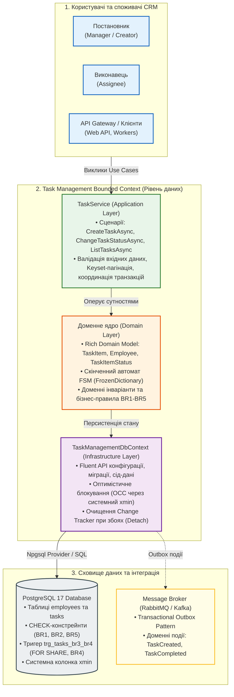
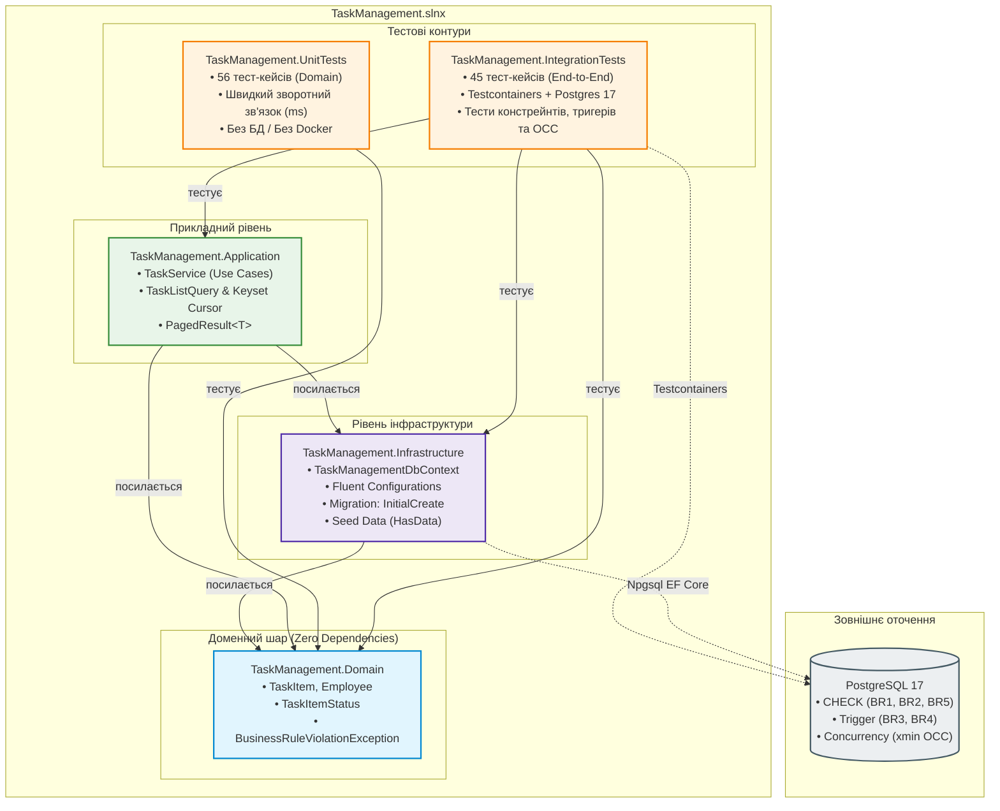
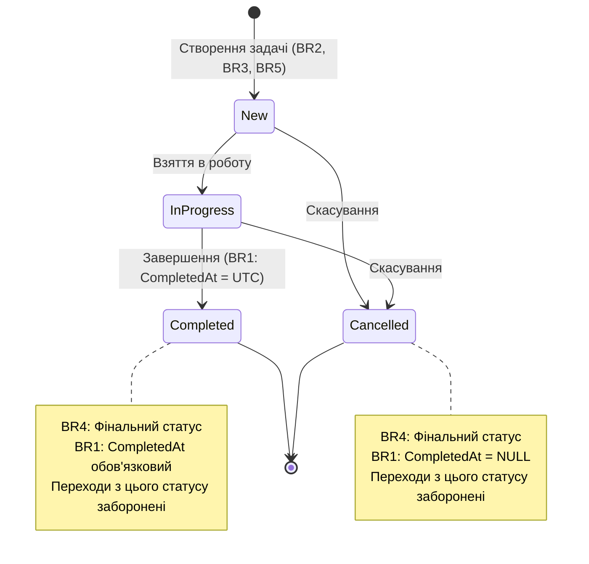

# Task Management: рівень даних (data layer)
 
[ Процес прийняття рішень (README) ](README.md) · [ **Технічний опис (Українська)** ] · [ Technical Overview (English) ](README.en.md)

**Task Management** - це внутрішній CRM-модуль для призначення, виконання та контролю завдань співробітників. Цей репозиторій є його рівнем даних на стеку **PostgreSQL + EF Core**: доменні сутності, персистентність, прикладний сервіс та тести. Область дії охоплює виключно бекенд/рівень даних: без веб-API, без інтерфейсу користувача (UI) та без окремого хост-сервера.

| Задача | Сценарій використання | Реалізація |
|---|---|---|
| **Призначення**: автор ставить завдання співробітнику | `CreateTaskAsync` | Доменні перевірки при створенні, прикладний сервіс; забезпечує дотримання BR2, BR3, BR5 |
| **Виконання**: завдання рухається життєвим циклом статусів | `ChangeTaskStatusAsync` | Доменна логіка переходів між статусами; забезпечує дотримання BR1, BR4 |
| **Контроль**: які завдання має співробітник, у якому статусі та з яким дедлайном | `ListTasksAsync` (`TaskListQuery`: keyset-пагінація `TaskCursor`/`PagedResult`, фільтри за статусом, автором, дедлайном; сумісний `ListTasksByAssigneeAsync`), сортування за дедлайном | Запит прикладного сервісу; використовує індекс `ix_tasks_assignee_id_status` |

## Загальна високорівнева архітектура (High-Level System Context)



## Структура рішення (Solution layout)



| Проєкт (шлях) | Вміст |
|---|---|
| `src/TaskManagement.Domain` | Доменні сутності (`Employee`, `TaskItem`), перелік (`TaskItemStatus`), доменний виняток (`BusinessRuleViolationException`). Чистий C#, без сторонніх бібліотек. |
| `src/TaskManagement.Infrastructure` | `TaskManagementDbContext`, Fluent-конфігурації, демо-дані (`HasData`), міграція `InitialCreate`, фабрика часу проектування (`TaskManagementDbContextFactory`). |
| `src/TaskManagement.Application` | `TaskService` із трьома сценаріями використання: `CreateTaskAsync`, `ChangeTaskStatusAsync`, `ListTasksAsync` / `ListTasksByAssigneeAsync`, `TaskListQuery`, `TaskCursor`, `PagedResult<T>`. |
| `tests/TaskManagement.UnitTests` | Доменні модульні тести (36 методів, 56 тест-кейсів після розгортання теорій); посилається тільки на `Domain`. |
| `tests/TaskManagement.IntegrationTests` | Інтеграційні тести бази даних PostgreSQL та сервісу (44 методи, 45 тест-кейсів); посилається на `Domain`, `Infrastructure`, `Application`; виконується через Testcontainers. |

## Швидкий старт (Quickstart)

Для роботи з проєктом необхідні встановлені **.NET 10 SDK** та **Docker** (для Testcontainers із PostgreSQL 17). Детальний аналіз вибору платформи та архітектурних рішень наведено в [README.md (Розділ 2.1)](README.md#21-стратегічний-вибір-платформи-net-10-lts-vs-sts-та-субд-postgresql-17).

### Збірка та тестування

Збірка з трактуванням попереджень як помилок (`TreatWarningsAsErrors`):
```bash
dotnet build -warnaserror
```

Запуск виключно модульних тестів (швидкий зворотний зв'язок, без потреби в Docker):
```bash
dotnet test --filter Category=Unit
```

Запуск усіх 101 тестів (включно з 45 інтеграційними на PostgreSQL 17 у Docker):
```bash
dotnet test
```

> **Примітка щодо CI/CD:** Зовнішній CI-пайплайн свідомо не налаштовувався (YAGNI). Усі 101 тест та контроль якості (`TreatWarningsAsErrors`) детерміновано перевіряються локально через Testcontainers та реальний PostgreSQL 17 (детальніше див. [README.md (Розділ 4.5)](README.md#45-свідома-відмова-від-побудови-ci-пайплайну-conscious-choice--yagni)).

### Керування міграціями (EF Core CLI)

Створення нової міграції:
```bash
dotnet ef migrations add <Name> --project src/TaskManagement.Infrastructure
```

Застосування міграцій до цільової бази даних:
```bash
dotnet ef database update --project src/TaskManagement.Infrastructure --connection "<connection string>"
```

> Початкова міграція `InitialCreate` автоматично створює повну схему (таблиці, індекси, CHECK-констрейнти, тригер `trg_tasks_br3_br4`) та мінімальні сід-дані для перевірки.

## Where each business rule is enforced - Де забезпечується кожне бізнес-правило



| Правило | Формулювання | Доменний рівень (Domain) | Рівень бази даних (Database) | Прикладний сервіс (Application service) |
|---|---|---|---|---|
| BR1 | `CompletedAt` обов'язковий тоді й тільки тоді, коли статус = `Completed` | `TaskItem.Create` встановлює `CompletedAt = null`; `TaskItem.ChangeStatus` встановлює його в `changedAt` (UTC), якщо статус стає `Completed`, інакше `null` | `ck_tasks_br1_completed_at_iff_completed` | `TaskService.ChangeTaskStatusAsync` передає `timeProvider.GetUtcNow()` як `changedAt` |
| BR2 | `DueAt` не може бути раніше за `PlannedStartAt` (nullable; діє лише коли обидві дати задані) | Guard-перевірка в `TaskItem.Create`: після нормалізації до UTC, якщо `dueAt < plannedStartAt` → виняток | `ck_tasks_br2_due_at_not_before_planned_start_at` | `TaskService.CreateTaskAsync` через домен |
| BR3 | Неактивному співробітнику не можна призначити нове завдання | Guard-перевірка в `TaskItem.Create`: `!assignee.IsActive` → виняток | Тригер `trg_tasks_br3_br4` на `INSERT`: читає `is_active` виконавця під `FOR SHARE`; якщо неактивний → помилка `trg_tasks_br3_assignee_active` | `TaskService.CreateTaskAsync`: власна перевірка перед доменом; перехоплює помилку тригера як `BusinessRuleViolationException("BR3", …, inner)` |
| BR4 | `Completed` та `Cancelled` є фінальними (перехід з них заборонено, включно з переходом у себе) | Guard-перевірка в `TaskItem.ChangeStatus`: якщо поточний статус `Completed` або `Cancelled` → виняток; стан не змінюється | Тригер `trg_tasks_br3_br4` на `UPDATE OF status`: спроба змінити статус → помилка `trg_tasks_br4_final_status`; токен конкурентності `xmin` блокує паралельні перезаписи | `TaskService.ChangeTaskStatusAsync` через домен; `DbUpdateConcurrencyException` прокидається нагору |
| BR5 | Завдання не може бути призначене своєму автору (`assignee_id ≠ creator_id`) | Guard-перевірка в `TaskItem.Create`: `creator.Id == assignee.Id` → виняток | `ck_tasks_br5_assignee_not_creator` | `TaskService.CreateTaskAsync` через домен |

> **Верифікація правил та демо-дані:**
> - Повний протокол red-evidence верифікації (перевірка failing-then-passing при почерговому відключенні захистів) та звіт про 101 тест задокументовано в [docs/testing/red-evidence.md](docs/testing/red-evidence.md) (також див. [README.md (Розділ 4.3)](README.md#43-результати-тестування-56-unit-тестів--45-інтеграційних-тестів-101-тест)).
> - Початкові демо-дані (Олена Коваленко, Богдан Шевченко, Оксана Мельник для тестування BR3 та 3 задачі) детально описані в [README.md (Розділ 1.3)](README.md#13-моделювання-демо-даних-seed-data-та-роль-неактивного-співробітника).
> - Інженерна культура: для паралельної розробки та мультиагентної співпраці використовувалися ізольовані `git worktree` з наступним очищенням через `git worktree prune` (див. [README.md (Розділ 4.1)](README.md#інженерна-культура-та-git-worktrees-паралелізм-без-конфліктів)).
> - Інженерний процес, планування (Zero-Code Planning, Human Gate), Agile-ітерації, навички критика (grill-me) та доказовість: протокол `[uncertain]`, стрес-допит рішень критика `/grill-me`, заземлення через CodeGraph, мутаційне тестування Red Evidence та виробничі метрики продуктивності (див. [README.md (Розділи 2.5, 4.6, 4.7)](README.md#фази-інженерного-процесу-та-agile-підхід-agile-lifecycle--engineering-phases)).

## Документація (Documentation)

- **[README.en.md](README.en.md)**: Англомовна версія цього файлу (English version of this README).
- **[AGENTS.md](AGENTS.md)**: Інструкції для агентів кодування (Claude Code, Cursor, Codex, Antigravity, AWS Bedrock).
- **[.wiki/index.md](.wiki/index.md)**: Головна сторінка бази знань (українською). Посилання на специфікацію домену, правила, ADR, граф виконання ([`.wiki/plan/graph.yaml`](.wiki/plan/graph.yaml)), лог сесій ([`.wiki/log.md`](.wiki/log.md)) та чекпоінти ([`.wiki/checkpoints/`](.wiki/checkpoints/)). Англомовна версія: [`.wiki/index.en.md`](.wiki/index.en.md).
- **[.wiki/domain/spec.md](.wiki/domain/spec.md)**: Повна специфікація моделі даних (N1 spec) із сутностями, обмеженнями, індексами, SQL тригера та планом тестів (англомовна версія: [`.wiki/domain/spec.en.md`](.wiki/domain/spec.en.md)).
- **[.wiki/domain/](.wiki/domain/)**: Сторінки бізнес-правил [`br1-completed-at.md`](.wiki/domain/br1-completed-at.md), [`br2-due-not-before-start.md`](.wiki/domain/br2-due-not-before-start.md), [`br3-inactive-assignee.md`](.wiki/domain/br3-inactive-assignee.md), [`br4-final-statuses.md`](.wiki/domain/br4-final-statuses.md), [`br5-no-self-assignment.md`](.wiki/domain/br5-no-self-assignment.md) та сутностей [`employee.md`](.wiki/domain/employee.md), [`task-item.md`](.wiki/domain/task-item.md).
- **[docs/adr/](docs/adr/)**: Дев'ять звітів про архітектурні рішення ([0001](docs/adr/0001-solution-layout.md)-[0009](docs/adr/0009-br3-br4-enforced-by-trigger.md)).
